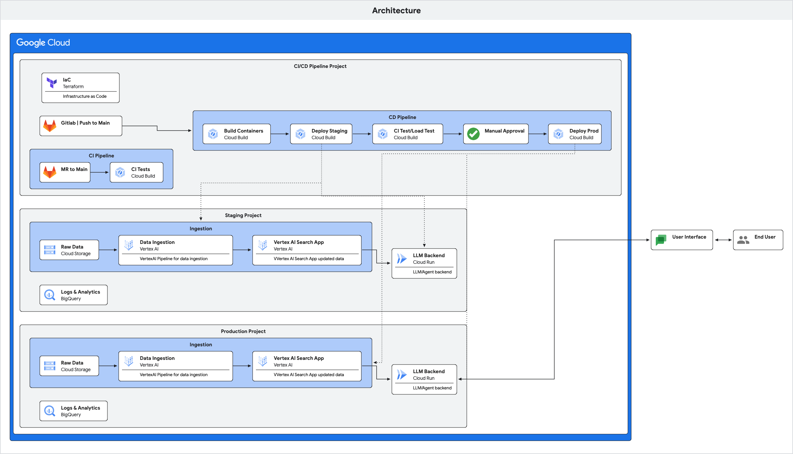

# Agent Builder Search Pattern

This pattern extends the Gen AI App Starter Pack, introducing a robust **data ingestion pipeline** for enriching your Retrieval Augmented Generation (RAG) applications. It leverages Vertex AI Search, enabling you to ingest, process, and embed your custom data for improved relevance and context in generated responses.

**Introduction of the data ingestion pipeline production ready:** This pattern will give you all the infrastructure to create a Vertex AI pipeline with your custom code. Because it uses Vertex AI data pipeline, you will benefit from all its features. For example, you can choose to run it once or multiple times or on a schedule.

**Agent Builder Search** (or Vertex AI search) is the Google Cloud offering that will provide you with state of the art search. In this pattern, we ingest structured data but you can easily switch with unstructured by changing the (1) the ingestion code and (2) the langchain retriever. We are also providing 2 search mechanisms: custom embedding and relevancy search. You can use one or the other or both. The relevancy search is unique to Google and usually performs best but you can also use your own embeddings if you want.

## Architecture

The pattern implements the following architecture:


The main addition to the base pattern is the addition of the ingestion components.

### Key Features

* **Vertex AI Search Integration:**  Utilizes Vertex AI Search for efficient data storage and retrieval.
* **Automated Data Ingestion Pipeline:** Automates the process of ingesting data from input sources.
* **Custom Embeddings:** Generates embeddings using Vertex AI Embeddings and incorporates them into your data for enhanced semantic search.
* **Terraform Deployment:** Ingestion pipeline is instantiated with Terraform alongside the rest of the infrastructure of the starter pack.
* **Cloud Build Integration:**  Deployment of ingestion pipelines is added to the CD pipelines of the starter pack.
* **Customizable Code:** Easily adapt and customize the code to fit your specific application needs and data sources.

From an infrastructure point of view, a *Vertexai Agent Builder Datastore* and *Search App* are being initialised in both staging and prod environments. You can learn more about these [here](https://cloud.google.com/generative-ai-app-builder/docs/enterprise-search-introduction).

When a new build is triggered through a commit to the main branch, in addition to updating the backend application, the data ingestion pipeline is also updated.

The data ingestion is orchestrated through a Vertex AI [Pipeline](https://cloud.google.com/vertex-ai/docs/pipelines/introduction) which in its simplest form comprises of a single processing step. During this step, data are being read (in this example we start from a single PDF document) from your preferred location, then the data are being chunked and prepared for ingestion to the agent builder store which is being kicked off. The Search app is automatically updated with the latest data as soon as the data ingestion is complete with zero downtime.

Please note that the ingestion in the example is set to run automatically once per week. You may change the frequency of the update or  the triggering mechanism altogether to match your needs. Look into the data_ingestion/pipeline.py file as the starting point for these changes.

## Getting Started

In order to implement data ingestion for the datastore, you need to replace some of the
existing files with new ones provided in the resources_to_copy folder

Run the following bash commands to perform all necessary copies. Once completed, follow the remaining instructions from the parent [folders](https://github.com/GoogleCloudPlatform/generative-ai/blob/main/gemini/sample-apps/e2e-gen-ai-app-starter-pack/deployment/README.md).

```bash
./app/patterns/agent_builder_search/prepare_pattern.sh
```

## Additional note

Since Vertex AI uses regions and Agent Builder uses multiregions (eu or us or global), we have named them differently (MULTI_REGION vs SINGLE_REGION).
